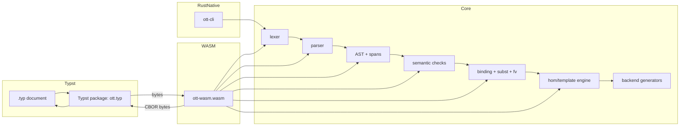

# Design Log: Next‑Gen Ott Toolchain (Rust + WASM + Typst)

Date: 2026-03-04

Baseline compatibility target: **Ott v0.30** (behavioral equivalence; see “Compatibility Contract”).

> This document is a design log (not yet an implementation log). Once implementation starts, we will only append results/deviations.

---

## Background

Ott is a meta-tool for defining the syntax and semantics of programming languages and calculi in a readable ASCII notation, then compiling that definition to multiple targets (LaTeX typesetting, Coq/HOL/Isabelle/HOL/Lem definitions, OCaml AST + Menhir parser, etc.).

The legacy toolchain is strongly coupled to:

- **OCaml** implementation choices and dependencies (e.g. ocamlgraph for dependency resolution), making reuse in modern toolchains and web environments difficult.
- **LaTeX** as the primary typesetting backend, which often implies slow compile cycles, hard-to-read errors, and a non-interactive authoring experience.

Typst is a modern, Rust-based typesetting system with near real-time compilation and a native WASM plugin mechanism. Rebuilding Ott in Rust and integrating it into Typst via WASM enables a new workflow: edit semantics definitions and see grammars/inference rules update immediately, without external preprocessors.

---

## Problem

We want a next-generation Ott toolchain that:

1. Re-implements Ott **fully** in Rust, preserving Ott’s semantics, checks, and outputs.
2. Integrates with Typst via **WASM plugin** to render grammars and inference rules directly in Typst.
3. Provides **dual-mode delivery**:
   - **WASM plugin mode** for typesetting and filter-mode transformations inside Typst.
   - **Native CLI mode** to generate files for Coq/Isabelle/HOL/Lem/OCaml/Menhir and to run batch checks.
4. Keeps authoring ergonomic: good errors with spans, stable outputs, and a deterministic pipeline.

Constraints:

- Typst WASM plugins are sandboxed: **no filesystem I/O** and should remain pure.
- The boundary is bytes-only: Typst ↔ WASM communicates via **byte buffers**.
- We must maintain a crisp “compatibility contract” with reference Ott v0.30.

---

## Questions and Answers

### Q1. What does “Ott v0.30 compatible” mean?

**Answer**: Compatibility is defined as:

- **Accepting the same input language** (Ott ASCII DSL) for the supported features.
- Performing equivalent **semantic checks** and rejecting the same ill-formed programs (up to improved diagnostics).
- Producing outputs that are **logically equivalent** to reference Ott for each backend.

We do **not** require byte-for-byte identical output, but we require that generated definitions/proofs parse and behave equivalently in the target systems (Coq/Isabelle/HOL/OCaml/Menhir).

### Q2. How will Typst interact with the Rust engine?

**Answer**: Use Typst’s `plugin("...")` and `wasm-minimal-protocol` on the Rust side. Plugin functions will accept UTF-8 bytes and return either:

- `Ok(Vec<u8>)` containing **CBOR** encoded render data, or
- `Err(String)` with a human-readable error message (Typst will display it).

This follows a proven pattern already used for other Typst WASM integrations (CBOR payload + Typst-side decoding).

### Q3. CBOR schema: structured data or “Typst code strings”?

**Answer**: Prefer **structured CBOR**.

- Pros: avoids `eval`-based injection issues, keeps a stable ABI, allows Typst-side layout evolution without re-encoding as strings, and enables richer rendering.
- Cons: more work upfront.

We will still allow an *optional* “debug mode” in CLI that prints a readable JSON form for inspection.

### Q4. Parser approach?

**Answer**: Use a dedicated lexer + parser with explicit spans:

- Lexer: `logos` (fast, deterministic) or a small handwritten lexer if necessary.
- Parser: **LALRPOP** for an explicit grammar and maintainability.

Rationale: Ott’s DSL is non-trivial (multiple sections, annotations, template blocks, precedence declarations). LALRPOP keeps the grammar visible and testable.

### Q5. Binding specifications and substitution: which representation?

**Answer**: Implement binding and substitution in a way that is compatible with Ott’s binding-spec semantics. Internally we will adopt **locally nameless** representation for variable binding-sensitive operations, inspired by the “unbound” approach.

We will keep source-level names for pretty-printing while using stable indices for alpha-equivalence, fv, and substitution.

### Q6. How do we validate correctness against reference Ott?

**Answer**: Build a regression suite around canonical Ott example specs (e.g. TAPL fragments, Lightweight Java).

- For each example: run reference Ott v0.30 and our CLI, compare:
  - parse success/failure,
  - reported errors (category + location),
  - generated backend artifacts compile / are accepted by their target tools.

---

## Design

### High-level architecture

We implement a **single Rust core** with two frontends:

- `ott-cli` (native binary)
- `ott-wasm` (cdylib compiled to `wasm32-unknown-unknown`)

Both link the same internal crates.



### Cargo workspace layout

Planned workspace structure:

- `crates/ott-core/`
  - parser, AST, semantic checks, common data structures
- `crates/ott-bind/`
  - binding specs evaluation, freevars/substitution generation
- `crates/ott-hom/`
  - hom/template engine (tex/coq/isa/etc)
- `crates/ott-render/`
  - render-oriented IR for Typst (inference rules, grammar tables)
- `crates/ott-backend/`
  - backend-agnostic interfaces
- `crates/ott-backend-coq/`, `...-isabelle/`, `...-hol4/`, `...-lem/`, `...-ocaml/`, `...-menhir/`
- `crates/ott-cli/` (bin)
- `crates/ott-wasm/` (cdylib)

We keep the WASM-facing crate thin: it should only do argument decoding, call core APIs, and serialize responses.

### Public API (core)

A stable internal API that both CLI and WASM call:

```rust
pub struct OttOptions {
  pub enable_filter_mode: bool,
  pub strict: bool,
}

pub struct ParsedSpec { /* spans + AST */ }

pub struct CheckedSpec { /* resolved, sorted, ready for rendering/codegen */ }

pub fn parse_spec(src: &str) -> Result<ParsedSpec, OttError>;
pub fn check_spec(spec: ParsedSpec, opts: &OttOptions) -> Result<CheckedSpec, OttError>;

pub fn render_for_typst(spec: &CheckedSpec) -> TypstRenderDoc;
```

Error model:

- `OttError` always carries a span (byte range + line/col) and an error kind.
- CLI uses `miette` (or equivalent) to print rich diagnostics.
- WASM maps `OttError` to a single human-readable string; Typst displays it inline.

### Typst plugin ABI

Rust (`ott-wasm`) uses `wasm-minimal-protocol`:

- `initiate_protocol!();`
- Exported functions are `#[wasm_func]`.

Planned exports (minimum set):

- `parse_rules(spec_bytes: &[u8]) -> Result<Vec<u8>, String>`
  - input: full Ott spec (or a relevant subset)
  - output: CBOR encoded `TypstRenderDoc`

- `parse_inline_term(term_bytes: &[u8], grammar_name: &[u8]) -> Result<Vec<u8>, String>`
  - used by filter-mode: parse `[[ ... ]]` against previously defined grammar context

### CBOR schema (TypstRenderDoc)

We represent renderable items as a tagged sum. Encoded as CBOR arrays for compactness.

- Document: `["doc", items...]`
- Inference rule: `["rule", name, premises[], conclusion]`
- Grammar block: `["grammar", nonterminal, alternatives[]]`

Formula / term rendering is represented as “segments”, similar to an existing Typst WASM pattern:

- Text segment: `[0, txt]`
- Math segment: `[1, txt]` (Typst-side will wrap in `$...$` or construct math)
- Newline: `[2]`

This is intentionally conservative for v1. Over time we can refine into a structured math AST.

### Typst package layout

We provide a Typst package (local, later publishable):

- `typst/ott.typ`
  - loads the plugin: `#let ott = plugin("plugins/ott.wasm")`
  - decodes CBOR: `#let doc = cbor.decode(ott.parse_rules(...))`
  - rendering functions:
    - `render_rule` → `curryst.rule` / `curryst.prooftree`
    - `render_grammar` → grid/table aligned `::=` and `|`
  - optional `#show` rules to implement filter-mode for `[[...]]`

Rendering dependencies:

- `curryst` for proof trees / inference rules.

### Compatibility Contract

We explicitly track:

- Supported Ott constructs (by manual section) and their status.
- Known deviations (if any) with justification.

Every deviation must be documented and covered by tests.

---

## Implementation Plan (phased, but continuously shippable)

> The user requested that implementation proceeds immediately after this design log. We will follow this plan sequentially and keep the tree always buildable.

### Phase 0 — Repository and tooling

- Create a Cargo workspace with the crates listed above (start with `ott-core`, `ott-cli`, `ott-wasm`, `ott-render`).
- Add formatting/lints:
  - `rustfmt`, `clippy` (deny warnings in CI)
- Add basic CI (if applicable): `cargo test`, `cargo fmt --check`, `cargo clippy`.

### Phase 1 — Core parsing + AST + semantic checks (subset, but solid)

- Implement lexer + parser for:
  - metavariables, terminals, nonterminals
  - grammar productions
  - inference rules with premises/conclusion (enough to typeset)
- Implement dependency graph + topological sort with `petgraph`.
- Implement a minimal semantic checker:
  - undefined references
  - duplicate names
  - cyclic dependencies

Deliverables:

- `ott-cli check spec.ott` works and prints diagnostics.
- Unit tests for parser and semantic checks.

### Phase 2 — Typst WASM integration and rendering

- Implement `ott-wasm` using `wasm-minimal-protocol`.
- Define CBOR schema and implement encoding via `ciborium`.
- Write `typst/ott.typ`:
  - decode CBOR
  - render rules via `curryst`
  - render grammars via table/grid

Deliverables:

- A Typst example document compiles and shows grammars + rules.

### Phase 3 — Binding specs, fv/subst, hom/templates, filter-mode

- Implement binding spec evaluation and term operations (alpha-equivalence, fv, subst).
- Implement hom/template engine for at least:
  - `tex`, `coq`, `isasyn` blocks
- Implement filter-mode in Typst:
  - parse `[[...]]` segments and render as math/terms

Deliverables:

- A non-trivial Ott spec with binding generates consistent substitutions and renders in Typst.

### Phase 4 — Code generation backends

- Implement backends iteratively, starting with Coq (most used), then Isabelle/HOL, HOL4, Lem, OCaml AST, Menhir.
- Provide backend tests:
  - generated files parse/typecheck in the target toolchains (where available).

Deliverables:

- `ott-cli gen --backend coq spec.ott -o out/` produces buildable Coq code.

### Phase 5 — Regression suite and performance

- Collect canonical Ott examples; add as fixtures.
- For each fixture:
  - compare our output acceptance with reference Ott v0.30.
- Optimize hot paths:
  - arena allocation where helpful
  - interned strings for identifiers

---

## Examples

### Typst usage (sketch)

```typst
#import "typst/ott.typ": ott

#ott.render(
  read("spec.ott")
)
```

### CLI usage (sketch)

```bash
ott-cli check spec.ott
ott-cli gen --backend coq spec.ott -o out/
```

---

## Trade-offs

- **Structured CBOR vs Typst code strings**: structured chosen for ABI stability and better rendering evolution.
- **LALRPOP vs hand parser**: LALRPOP chosen for explicit grammar and long-term maintainability.
- **Locally nameless**: more complex, but yields correct alpha-equivalence and substitution behavior.

---

## Implementation Results (append-only)

(Implementation not started yet.)

### 2026-03-04 — Phase 0–2 MVP implemented (core parse + WASM + Typst rendering)

Implemented a continuously-buildable MVP that already provides end-to-end Typst rendering (grammar + inference rules) via a Rust WASM plugin.

**Repository structure created**
- Rust workspace: `Cargo.toml` (workspace)
- Crates:
  - `crates/ott-core/` — line-oriented parser + basic checks
  - `crates/ott-render/` — Typst render IR + CBOR serialization + `render_for_typst`
  - `crates/ott-cli/` — CLI (`check`, `render-json`, `render-cbor`)
  - `crates/ott-wasm/` — WASM plugin (`wasm-minimal-protocol`) exporting `parse_rules`
- Typst module: `typst/ott.typ`
- Demo: `typst/demo.typ` and root `demo.typ`
- Fixture: `fixtures/tapl/arrow.ott` (from Ott examples)

**What works now**
- `cargo test` passes, including parsing/checking `fixtures/tapl/arrow.ott`.
- Build plugin:
  - `cargo build -p ott-wasm --release --target wasm32-unknown-unknown`
  - `cp target/wasm32-unknown-unknown/release/ott_wasm.wasm typst/plugins/ott.wasm`
- Compile Typst demo:
  - `typst compile --root . demo.typ /tmp/ott-demo.pdf`
  - Renders grammar blocks as a `table(...)` and inference rules as `curryst.prooftree(rule(...))`.

**Deviations / simplifications vs initial design (documented)**
- Parser is currently a custom line-oriented parser (not yet LALRPOP).
- CBOR schema is currently **structured dictionaries** (serde-encoded) rather than the planned compact tagged arrays.
- Formulas/terms are currently rendered as `raw(...)` strings (not a structured math AST, and not `$...$` Typst math).
- Filter-mode (`[[...]]`), binding-spec evaluation, hom/template processing, and proof-assistant backends are not implemented yet.

### 2026-03-04 — Parser coverage expanded (Ott test suite mostly parses)

Parser improvements in `crates/ott-core/src/parser.rs`:
- Support multi-line `metavar`/`indexvar` headers where `::=` appears on a later line.
- Support indented grammar rule headers and detect new headers regardless of indentation.
- Support rule-level `{{ ... }}` blocks placed on lines between a grammar header and the first production.
- Strip inline hom blocks from grammar roots/sorts (so roots like `a{{ isa ... }}` are recognized).
- Skip `>> ... <<` comment blocks (used to comment out grammar fragments).
- Support multi-line productions where the `:: ... :: ...` metadata appears on a later line.

Quick regression: `ott-cli check` succeeds on all upstream `ott` `tests/*.ott` except `test7.ott`, which also fails with reference Ott 0.34 (negative test).

### 2026-03-04 — Binding-spec parsing added (ott-bind) + strict checking

- Added `crates/ott-bind/`: a small lexer+parser for Ott binding specifications.
  - Supports `bind ... in ...`, assignments (`b = ...`), `union`, `#`, `{}` empty set.
  - Supports dotted forms `..` / `...` / `....` as a single expression constructor.
  - Accepts Ott list-form atoms like `</ p // i />` as an uninterpreted `Raw(...)` expression.
- Updated `crates/ott-core`:
  - Extract **multiple** `(+ ... +)` blocks per production (`bind_specs: Vec<String>`).
  - Avoid false-positive bind-spec extraction for quoted terminals like `'(+'` / `'+)'`.
  - `check_spec` now parses all binding specs (in `strict` mode) and fails fast on invalid syntax.

Regression: with strict bind-spec parsing enabled, `ott-cli check` still passes all upstream `ott` `tests/*.ott` except the known negative test `test7.ott`.

### 2026-03-04 — Typst inline `#ott[...]` API added

- Added an inline Typst helper in `typst/ott.typ`:
  - `#ott[```ott ...```]` renders an Ott snippet embedded directly in the Typst document.
  - `#ott-file("path/to/spec.ott")` is a convenience wrapper around `render(read(path))`.
- Updated demos: `demo.typ`, `typst/demo.typ`.
- Updated README usage examples.
- Verified end-to-end: `typst compile --root . demo.typ /tmp/ott-demo.pdf` succeeds.
